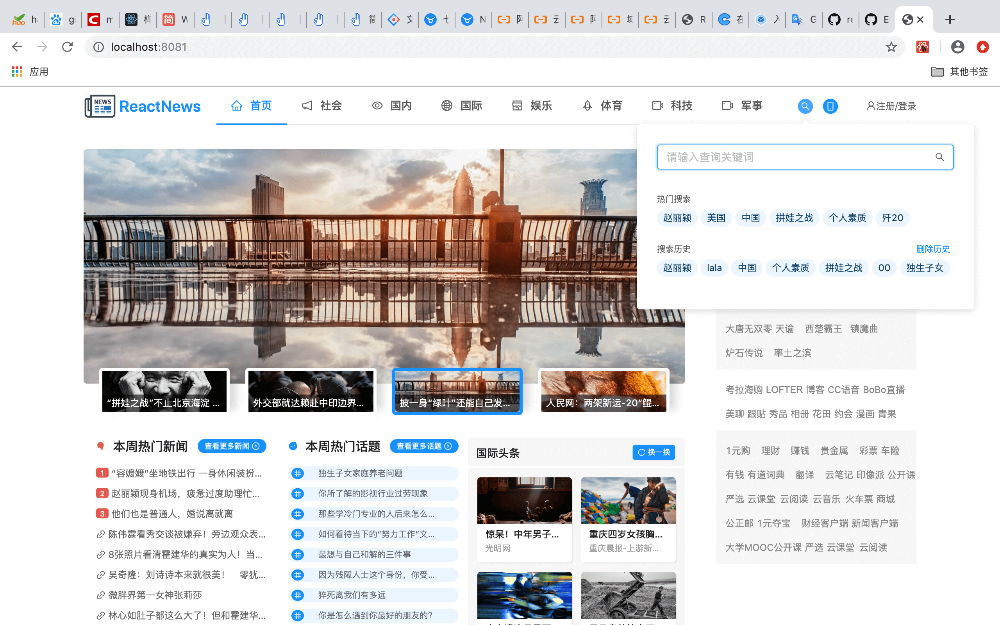
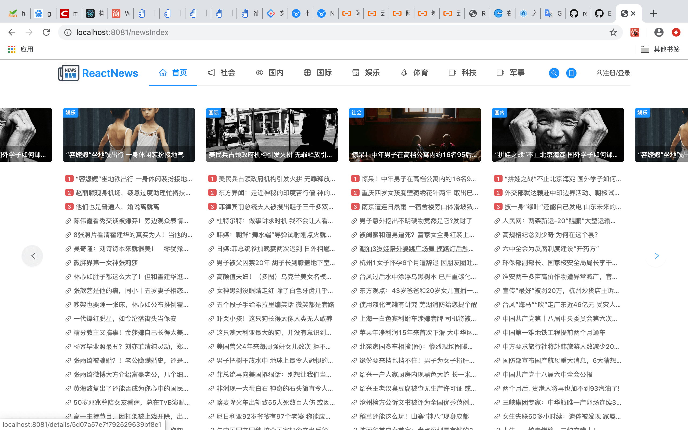
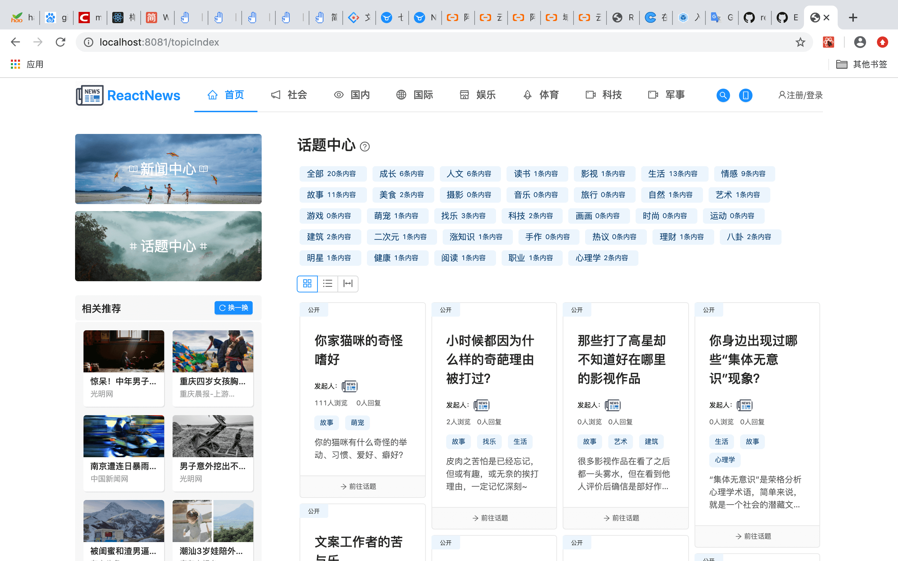
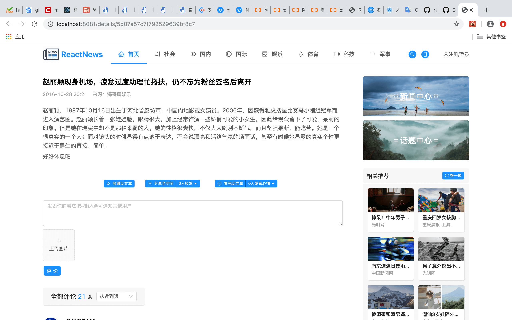
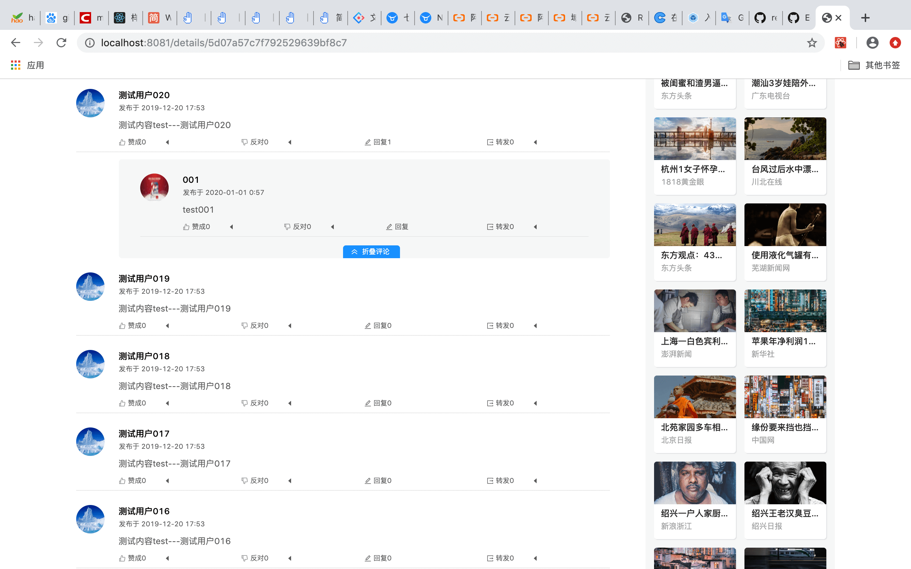
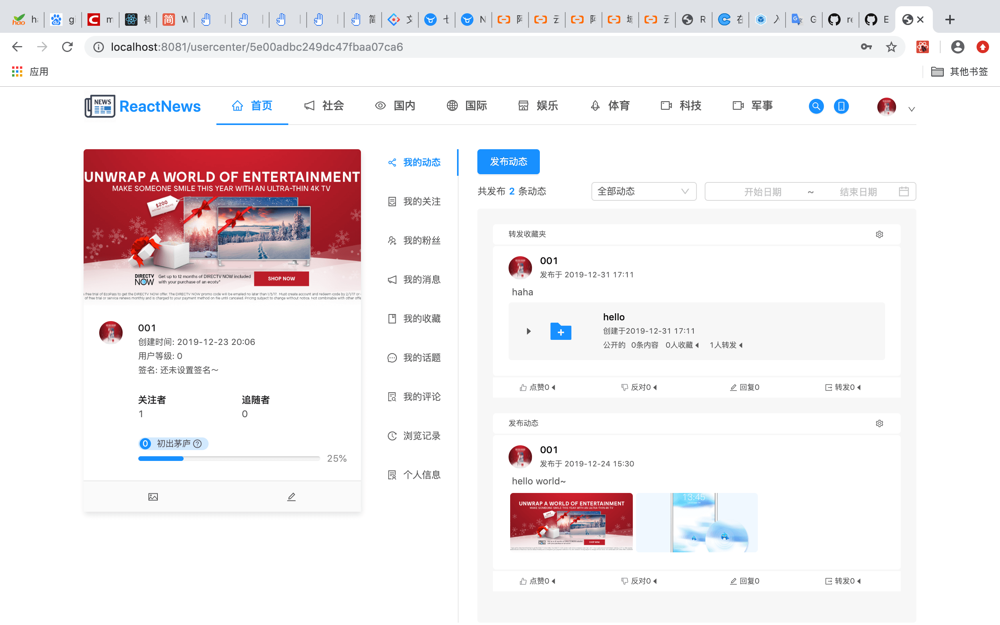

# React技术栈实现新闻平台

> 项目地址：https://github.com/FlyLikeBird/react-news

> 部署在阿里云地址：http://www.renshanhang.site

## 安装步骤
    
    # 克隆项目仓库到本地
    git clone git@github.com:FlyLikeBird/react-news.git
    
    # 安装项目依赖
    npm i (or yarn)
    
    # 开启本地服务http://localhost:8081即可运行
    npm start

## 技术栈
* react
* react-router
* react-router-dom
* react-responsive
* react-loadable
* antd
* babel
* webpack
* webpack-dev-server
* mongoose
* express

## 功能描述
  * 前端部分:
    1. 分类浏览新闻/收藏新闻/发布浏览心情/转发新闻的功能
    2. 新闻中心多类别新闻列表滚动加载的功能
    3. 话题广场按标签分类话题的功能
    4. 发布话题/收藏话题/关注话题/转发话题的功能
    5. 针对新闻/话题/动态的评论功能，可点赞/反对/回复/转发某条评论，可@用户发出通知消息
    6. 分享新闻/话题/动态至个人中心的社交功能
    7. 用户聊天功能和实时消息通知的功能
    8. 根据关键词搜索新闻/话题/用户的功能
    9. 个人中心的用户行为追踪功能，包括浏览记录/发布评论/关注用户等
    10. 用户积分功能，根据用户行为如发布话题/评论新闻等累计积分，实现等级提升
  * 后端部分:
    1. 用户注册/登录的身份验证功能
    2. Article/Topic/User等collection的mongoose数据库的增删改查操作
    3. 基于node.js的express响应用户请求
    4. express.Router实现路由管理
    5. 话题的标签管理
    6. 基于socket的实时推送消息机制
        
## 项目截图
* 首页

* 新闻中心

* 话题中心

* 新闻详情

* 评论

* 用户中心

